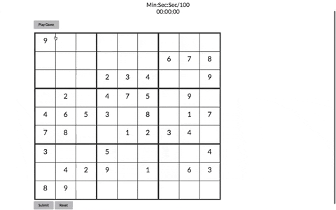

\*Frontend of mySudokuapp built with vanilla Javascript, HTML and CSS

\*Link to mySudoku game App demo video on youtube [demo video](https://youtu.be/R1lWOZmQq0o)

<h1 align="center">mySudokuApp </h1>

  A <code>JavaScript</code> application. User can play a timed Sudoku game

<!-- 

  Built with ✨ by
  <a href="https://github.com/bigfishh">Annie Zheng</a> and
  <a href="https://github.com/mqshaikh8"> Mohammed Shaikh</a>
  

 -->

 

  

  
 🧭Explore:
    <a href="https://www.youtube.com/watch?v=R1lWOZmQq0o">Demo</a> || <a href="https://sudokufrontend.herokuapp.com/">Deployed App on Heroku</a> || <a href="https://github.com/ajshemi/mySudokuapp-backend">Backend</a>
  

## Features

- Play Game
- Timer
- Reset Game
- Submit Game
- Refresh to Select a different Game

## Tech Stack

This web app is built with the following:

[**Backend**](https://github.com/ajshemi/mySudokuapp-backend)

- Ruby [2.6.1]
- Rails [~> 6.0.2] - MVC web framework used as an API
- Active Model Serializers [~> 0.10.0] - Serializing API routes to JSON
- PostgreSQL [>= 0.18, < 2.0] - Database

**Front End**

- Vanilla JavaScript [ES6]
- Custom CSS3 styling

## Installing

**Backend Installation:**

- Clone [backend repo](https://github.com/ajshemi/mySudokuapp-backend) to your local machine `git clone <backend-repo-url>`
- run `bundle install` to install required dependencies
- run `rails db:create` to create a database locally.
- run `rails db:migrate` to create tables into the database.
- run `rails db:seed` to create seed data.
- run `rails s` to run the server.

**Frontend Installation:**

- Clone this repo to your local machine `git clone <this-repo-url>`
- Ensure _transit-backend_ is running locally on `http://localhost:3000/`
- run `open index.html`
